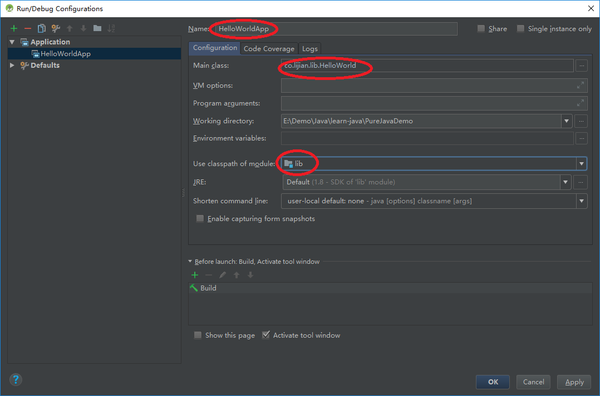

## PureJavaDemo

Android Studio pure java Demo.

下载下来后，需要在**Edit Configurations** 中配置

- click on the plus sign at the top left of the window and select **Application** 
- A new application configuration should appear, enter in the details such as your main class and classpath of your module.

参考：https://stackoverflow.com/questions/16626810/can-android-studio-be-used-to-run-standard-java-projects?utm_medium=organic&utm_source=google_rich_qa&utm_campaign=google_rich_qa